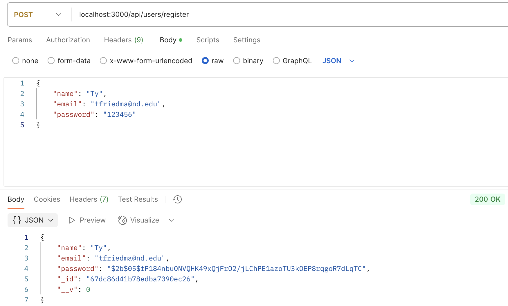
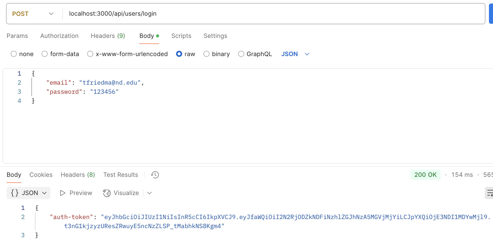
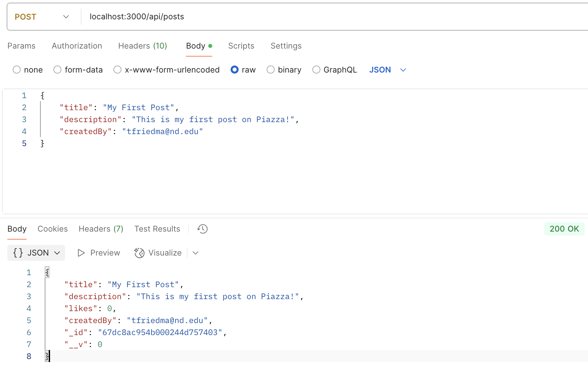
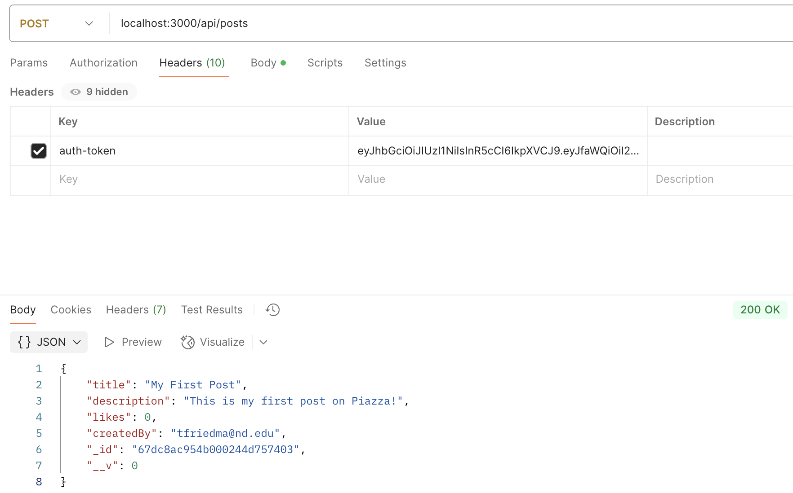

# Piazza Assignment (A2)

## User Authentication (login/register)
`REGISTER (with password hashed):`

`LOGIN (with auth-token sent back):`

## CRUD Operations for Posts

`Create a post (POST /posts) - requires authentication:`

`Get all posts (GET /posts) - publicly available:`

`Get a single post by ID (GET /posts/id) - publically available:`

`Update a post (PUT /posts/:id) - only the post creator can update:`

`Delete a post (DELETE /posts/:id) - only the post creator can delete:`

