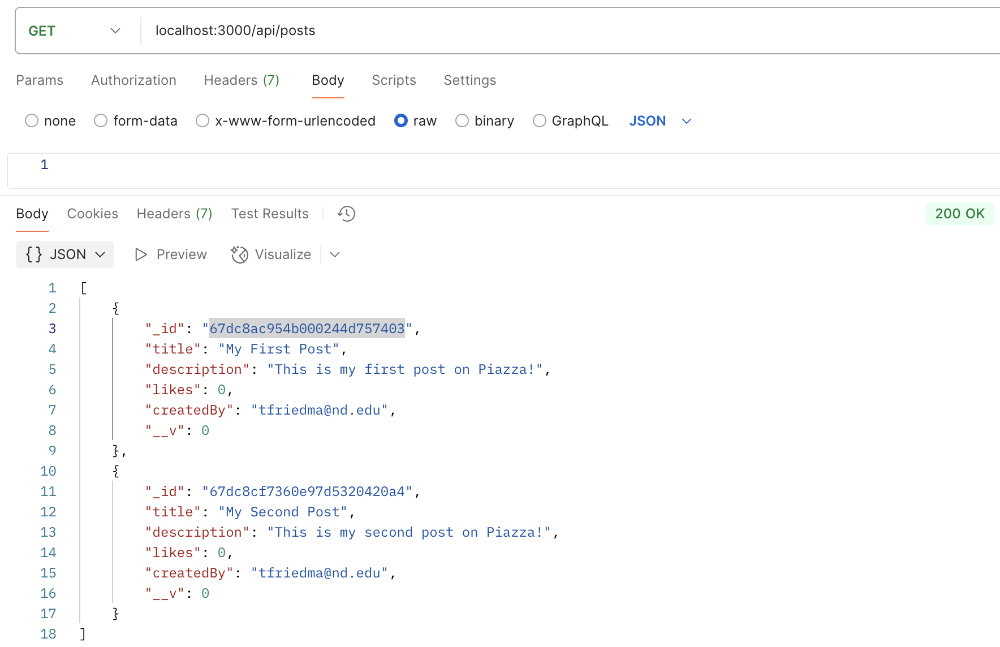
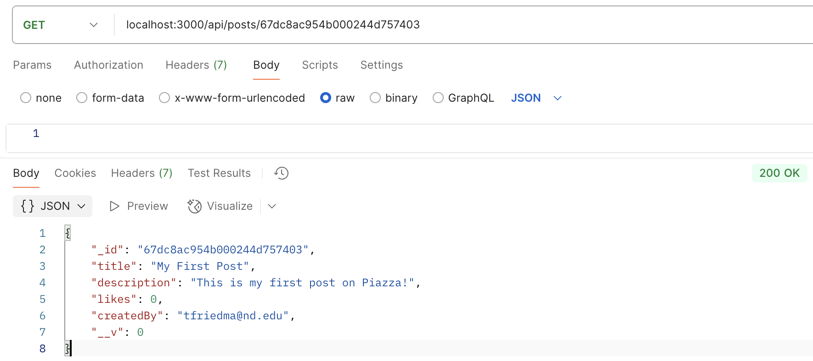
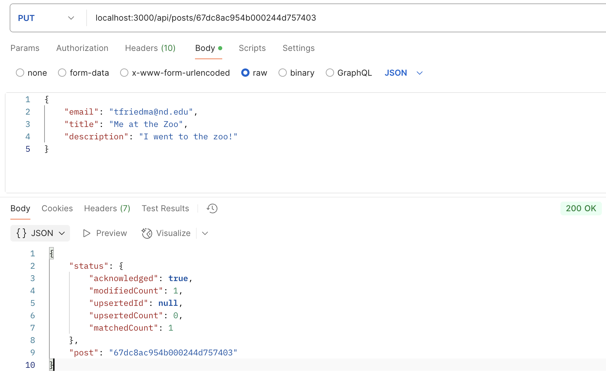
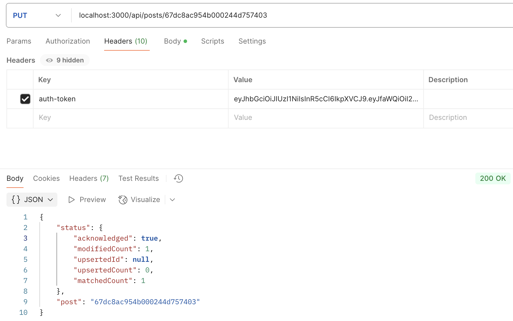
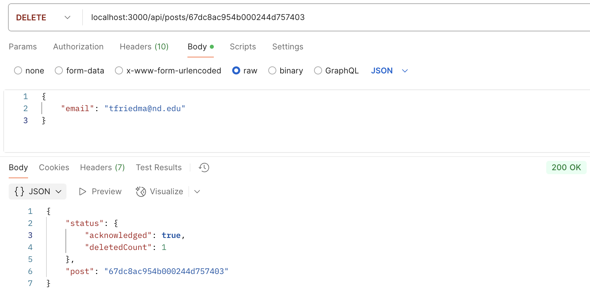

# Piazza Assignment (A2)

## Setup Instructions
* Initial setup
`npm init`
`npm install express nodemon mongoose dotenv body-parser`

* Install the joi for validations
`npm install joi`

* Install the encryption/decryption library
`npm install bcryptjs`

* Install the JWT package for generating auth tokens
`npm install jsonwebtoken`

## API Documentation

### Register: 
* Endpoint: `POST /users/register`
* Body: name, email, password
* Headers: N/A

### Login:
* Endpoint: `POST /users/login`
* Body: email, password
* Headers: N/A
* Returns: auth-token

### Create a post:
* Endpoint: `POST /posts`
* Body: title, description, createdBy
* Headers: auth-token

### Get all posts:
* Endpoint: `GET /posts`
* Body: N/A
* Headers: N/A

### Get single post:
* Endpoint: `GET /posts/:id`
* Body: N/A
* Headers: N/A

### Update a post:
* Endpoint: `PUT /posts/:id`
* Body: email (must match post), title (optional), description (optional)
* Headers: auth-token

### DELETE a post:
* Endpoint: `DELETE /posts/:id`
* Body: email (must match post)
* Headers: auth-token

## User Authentication (login/register):
### Register (POST /users/register):

### Login (POST /users/login):

## CRUD Operations for Posts:
### Create a post (POST /posts) - requires authentication:
`Showing body:`

`Showing headers:`

### Get all posts (GET /posts) - publicly available:

### Get a single post by ID (GET /posts/:id) - publically available:

### Update a post (PUT /posts/:id) - only the post creator can update:
`Showing body:`

`Showing headers:`

### Delete a post (DELETE /posts/:id) - only the post creator can delete:
`Showing body:`

`Showing headers:`

## Error Messages 